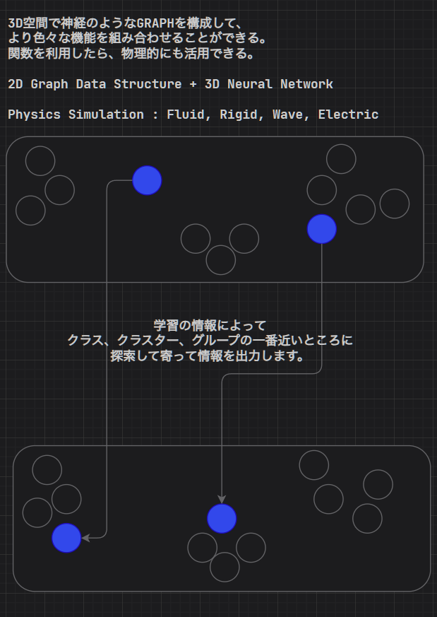

### AI研究について
#### 1. 現在のAIの流れと発展方向
2024.06

現在はどこまでどのようなAIモデルがあるかをご紹介します。

Classification, Regression, Clustering, Neural Network, Reinforment Learning, AI-Model(ChatGPT)
Train, Model-Data, Prediction

#### 2. 新しいAIモデルの設計と研究

下案

